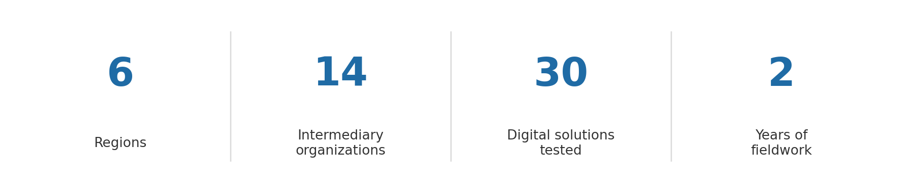
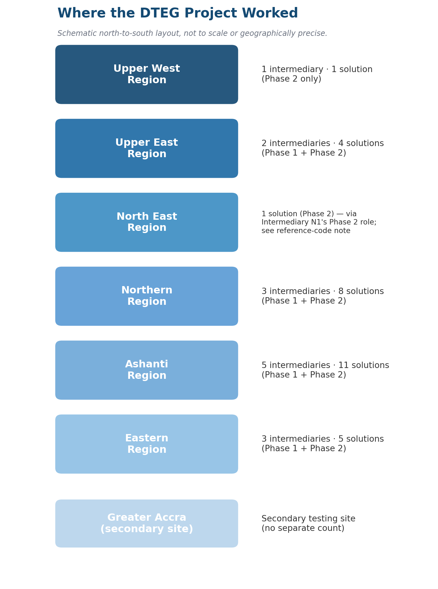

# 1. Introduction and Background

## 1.1 Who This Guide Is For

Three primary audiences will find this guide most useful:

1. **Innovation hubs, business coaches, and intermediary staff** advising women-led MSMEs on the adoption and use of digital solutions in peri-urban regions — including hubs in the Ghana Hubs Network considering user testing as a service line of their own.
2. **Designers and developers** building or adapting digital solutions who want to understand the specific constraints and expectations of this user group.
3. **Intermediaries supporting user research and technology adoption** in their communities, particularly those preparing to run user testing activities for the first time or improving on an existing approach.

A fourth audience — GIZ, donor, and government stakeholders assessing the DTEG project's outcomes and considering how to replicate or extend this approach — will find Sections 1, 5, 7, and 9 most directly relevant.

## 1.2 The Importance of User Research, UX/UI Design & Innovation

Digital technology is reshaping how small businesses operate across Ghana. Mobile money platforms, inventory apps, order management systems, cashback loyalty tools, and business communication platforms have the potential to help women micro-entrepreneurs work faster, record transactions more accurately, and reach more customers. But that potential is only realized when the tools actually work for the people they are supposed to serve.

Women-led businesses often operate under different conditions from those assumed by most technology design teams. Access to funding is more constrained. Reliance on community networks and peer trust is higher. Domestic and caregiving responsibilities compete directly with business time in a way most product teams do not design around — a tool that assumes a user can step away for an uninterrupted hour, or travel to a physical location during the day, is assuming away a constraint most participants in this guide's evidence actually live with. Many women concentrate in service, care, education, and creative sectors that digital products have historically underserved. In practice, many solutions were not designed with women in peri-urban and rural Ghana in mind. They assume a level of digital literacy, internet connectivity, and device ownership that does not reflect daily realities.

This guide exists to help change that, and it is built on three core principles:

- **Inclusive, not stereotypical.** Gender-responsive design does not mean pink interfaces or assumptions about what women want. It means understanding how women's actual lives, constraints, and contexts shape how they engage with digital tools.
- **Evidence-based, not trend-driven.** Every recommendation in this guide traces directly to documented field activity from the DTEG project. No claim is made without a source in the evidence record.
- **Context-aware, not one-size-fits-all.** Design principles transfer. Specific implementation details depend on region, language, product type, and user demographics. This guide provides the principles and the evidence; practitioners must apply both with judgment.

The purpose of this guide is not to set out universal rules for digital design — context varies too much for that. The purpose is to give practitioners a grounded, honest account of what worked, what failed, and why, so that future projects can build on these experiences rather than repeat the same mistakes. It covers the full arc of a user research and co-creation cycle: understanding users, training researchers, recruiting participants, designing instruments, facilitating co-creation, testing in real environments, and sustaining improvements over time.

As an open-source resource, this guide welcomes contributions from practitioners, researchers, designers, developers, and organizations working on inclusive digital products anywhere in the world, with particular relevance to sub-Saharan Africa and other contexts where similar user conditions apply.

## 1.3 About the DTEG Project and the Intermediary Cohort

The DTEG project (Digital Transformation for Inclusive Entrepreneurship in Ghana) was implemented between 2023 and 2025 across six regions of Ghana — Ashanti, Eastern, Northern, North East, Upper East, and Upper West — through a two-phase implementation approach.

Phase One focused on supporting existing digital solution providers to adapt and improve their products through user research, usability testing, co-creation, UX/UI consultation, and field validation. Solution providers in Phase One financed their own product adaptations based on the research findings.

Phase Two focused on enabling early-stage innovators to design and develop entirely new digital solutions, based on the needs identified through user-centred design, venture-building training, user research, and an incubation programme — supported directly by technical coaching and software development expertise. This is the key structural difference between the two phases: Phase Two solution providers received hands-on technical and software engineering support to build their prototypes, where Phase One providers had to resource that work themselves.

The project ran across four structured work packages: capacity building, user research and usability testing, co-creation and adaptation support, and field validation. A parallel monitoring, documentation, and knowledge-sharing effort ran throughout all phases and culminates in this guide.

More than 59 organizations responded to the project's call for intermediaries. Twelve were shortlisted through a structured scoring process that assessed organizational capacity, community networks, gender inclusion orientation, logistics, and regional coverage. The twelve shortlisted organizations were brought through an intensive training programme in UI/UX design methodology, user testing, and gender-sensitive research before being assigned to specific solution partnerships.

**How to read the reference codes.** Intermediary codes reflect the order and batch in which organizations were recruited, not a strict region rule — most letter groups do correspond to one region (E1–E3 are all Eastern Region; A1–A5 are all Ashanti Region), but Intermediary N1 is the one exception: recruited in the same batch as the other "N" organizations, it is actually based in Upper East Region, not Northern Region (see the region given for each entry below, not just the letter). Solutions are coded S1–S18 for Phase 1 (existing solutions adapted) and P1–P12 for Phase 2 (new solutions incubated). The same code refers to the same organization or solution every time it appears in this guide, so partnerships and case studies can still be followed end to end — the code just replaces the name.

**The intermediary cohort and solutions tested (Phase 1 — existing solutions, 12 intermediaries, 18 solutions):**

*Upper East Region*

1. **Intermediary N1**, Tamale-based operations. Tested Solution S1 with women traders, manufacturers, and business owners. Solution S1 was designed to unify order management, payments, and logistics across multiple channels.

*Northern Region*

1. **Intermediary N2**. Tested two solutions: Solution S2 with women micro-enterprise owners (business management, invoicing, and payment tracking), and Solution S18, a remittance and payment app that was discontinued during the project.
2. **Intermediary N3**. Tested Solution S3, a digital business management solution, covering financial records, customer management, and business operations.
3. **Intermediary N4**. Tested two solutions: Solution S4, for business communication and customer outreach, and Solution S5, a loyalty rewards platform for women traders that was discontinued during the project.

*Eastern Region*

1. **Intermediary E1**. Tested Solution S6, a digital business record-keeping and accounting solution, with women micro-entrepreneurs across the Eastern Region.
2. **Intermediary E2**. Tested Solution S7, an inventory management system, with women entrepreneurs including differently-abled business owners in the Eastern Region.
3. **Intermediary E3**. Led field validation of Solution S8 across Lower Manya, Asuogyaman, and Yilo Krobo districts, testing with women entrepreneurs in financial inclusion and credit access contexts. Sessions were conducted in Twi, Dangme, Ewe, and English.

*Ashanti Region*

1. **Intermediary A1**. Led field validation of Solution S9, a crop e-commerce and cold store management solution, testing with women smallholder farmers and agricultural traders.
2. **Intermediary A2**. Tested two solutions: Solution S10, a digital SME marketplace that was discontinued during the project, and Solution S11, a digital storefront and payment management application. Testing spanned both Greater Kumasi and Greater Accra, deliberately capturing differences between peri-urban and urban business contexts.
3. **Intermediary A3**. Tested two solutions, both documented at roster level only *(see note below)*: Solution S12, a financial management app, and Solution S13, an AI chatbot for business communications — the project's one AI-enabled solution.
4. **Intermediary A4**. Tested two solutions, both documented at roster level only *(see note below)*: Solution S14, an integrated communications platform, and Solution S15, a business management and e-commerce visibility tool.
5. **Intermediary A5**. Tested two solutions, both documented at roster level only *(see note below)*: Solution S16, a business management tool (no further detail available in project records), and Solution S17, a data management, analytics, and reporting solution.

**A note on the solutions tested.** Several intermediaries tested more than one solution, which is why Phase 1's solution count exceeds its intermediary count. Three of the eighteen were discontinued (Solution S5, Solution S10, and Solution S18) for reasons including provider capacity and shifting business priorities; the guide treats these as part of the honest record rather than omitting them. The remaining fifteen ranged from fully redesigned, launched applications (nine solutions) to redesigned prototypes still in development at the close of the project (six solutions). Solutions S12 through S18 (Intermediary A3, Intermediary A4, Intermediary A5's Phase 1 solutions, and Intermediary N2's Solution S18) are documented at roster level only in this edition — the field validation detail available for them is thinner than for the rest of the Phase 1 cohort, limited to the project's summary records rather than full validation reports.

Several solutions were still in active development at the time of testing. Solution S10, Solution S9 in some modules, and Solution S4 were among those where participants and intermediaries were providing feedback on an incomplete product. This required careful framing, honesty about the development stage, and a validation approach focused on design direction rather than live functionality.

Intermediary N2's partnership with Solution S2 raised a structural issue that recurred across the project: solution providers with limited financial and development capacity who genuinely could not commit the resources needed to act on co-creation feedback. This is a project design issue that future initiatives must address through provider readiness assessment before selection.

**Phase 2 — new solutions.** Alongside Phase 1, DTEG ran a second, parallel track: an ideation-to-incubation programme that took new, early-stage digital solutions from concept through prototyping with the same target population, extending into two regions that Phase 1 did not reach (Upper West and North East) alongside Northern, Eastern, Ashanti, and Upper East. A call for ideas drew 176 applicants; 29 startups were selected into the ideation phase, and twelve high-potential ideas progressed into the incubation programme itself. Selected ideation teams went through structured rounds of design-thinking workshops, incubation with hub and technical mentors — including, unlike Phase 1, direct software engineering support to build their prototypes — iterative MVP testing with target users, and a final pitching event judged by a panel including academic, hub, and MSME representatives. Six intermediaries supported Phase 2: four continued from Phase 1 (Intermediary N1, Intermediary N3, Intermediary E2, and Intermediary A4), and two joined newly (Intermediary U1, Upper East, and Intermediary UW1, Upper West). Upper West is the clearer of the two new regions — reached for the first time via Intermediary UW1. North East's status is less clean: the project's own Phase 2 documentation lists Intermediary N1's region as North East, even though the same organization's Phase 1 role was recorded as Upper East — an inconsistency in the project's own records that this guide flags rather than silently resolves (see the note on reference codes above). Upper East itself is not new to Phase 2 either way, since Intermediary N1 (under whichever region label) and Intermediary U1 both place Phase 2 activity there as well.

Of the twelve incubated solutions, six were selected as finalists at the closing pitch event and received in-kind prize support for further development. The twelve, with finalist status noted, are:

1. **Solution P1** (Intermediary U1, Upper East Region — Zaare, Tamale, Navrongo, Bolga). An e-commerce marketplace connecting women artisans directly to buyers.
2. **Solution P2** (Intermediary U1, Upper East Region — Builsa North Municipal). A booking platform connecting women smallholder livestock farmers with veterinary officers.
3. **Solution P3** (Intermediary A4, Ashanti Region). *Finalist — 2nd place.* A voice-enabled bookkeeping application for informal-sector traders with low literacy.
4. **Solution P4** (Intermediary A4, Ashanti Region — Asante Akim South District). A USSD-based platform connecting livestock farmers to veterinary services in under 30 seconds — distinct from Solution P2 despite the similar problem space.
5. **Solution P5** (Intermediary N3, Northern Region — Tamale). A milestone-based savings and crowdfunding platform for women-led village savings and loans associations (VSLAs).
6. **Solution P6** (Intermediary N3, Northern Region). *Finalist — 3rd place.* A digital savings-group (susu) management platform.
7. **Solution P7** (Intermediary N3, Northern Region). A simplified, offline-first bookkeeping tool designed specifically for women entrepreneurs with little or no prior digital experience.
8. **Solution P8** (Intermediary UW1, Upper West Region). *Finalist.* An on-demand platform connecting smallholder farmers to agricultural services.
9. **Solution P9** (Intermediary U1, Upper East Region). *Finalist.* A real-time mobile money fraud-verification app.
10. **Solution P10** (Intermediary E2, Eastern Region). An AI-enabled financial record-keeping tool with voice prompts for low-literacy users.
11. **Solution P11** (Intermediary E2, Eastern Region). *Finalist — 1st place.* An embedded, data-driven agricultural insurance platform for farmers.
12. **Solution P12** (Intermediary N1, North East Region). *Finalist.* A digital solution connecting farmers directly to markets to reduce post-harvest losses.

Solutions P8 through P12 (four of the six finalists) are documented at roster level only in this edition, for the same reason as Solutions S12–S18 in Phase 1: the guide's deeper case-study material (validation reports, direct quotes, task-completion data) exists for Solutions P1–P7 but not yet for these five. The project's original target, stated in its objectives, was eighteen solutions total (twelve Phase 1, six Phase 2); the higher actual delivered count reflects intermediaries testing more than one solution each in Phase 1, and Phase 2's ideation funnel carrying twelve concepts through incubation before narrowing to six finalists. Part B of Section 4 addresses the UI/UX design practice specific to the Phase 2 track in detail, concentrated on the seven solutions with full field evidence (Solutions P1–P7); Phase 2 evidence is also woven into Sections 2 and 5 where it adds to or usefully contrasts with Phase 1 findings.
