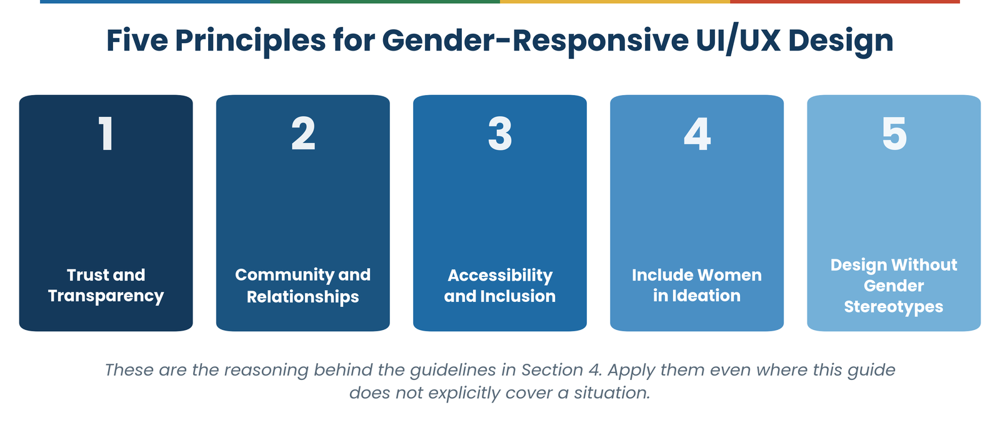

# 3. Principles for Gender-Responsive UI/UX Design

*The five commitments that gender-responsive design requires, and the evidence behind each.*

These principles, drawn from the project's combined field evidence and synthesized with inputs from the GIZ project team, represent the foundational commitments that gender-responsive digital design requires. They should inform product decisions at every stage, from the earliest concept to the latest iteration.

The principles do not replace specific design guidelines ([Section 6](06-toolkit.md) provides those). They are the "why" that gives the guidelines their direction. A designer who understands these principles can apply them even in situations this guide does not explicitly cover.

## 3.1 Trust and Transparency

**Design for trust before asking for engagement.**

Women in the project consistently made trust-based adoption decisions. A product that is unclear about its purpose, pricing, or data use will not be adopted regardless of its functional quality. In practice, this means:

- Use clear, plain language rather than technical jargon at every point of contact.
- Explain pricing and subscription terms directly, before sign-up, not buried in terms and conditions.
- Provide transparent explanations of privacy, data use, and fraud protection within the product itself, not only in documentation.
- Make human support visible. Knowing a real person can be reached increases willingness to try things independently.
- Show what happens after every action. Confirmation messages and status indicators reduce anxiety and prevent repeated actions.

Intermediary N2 and Intermediary A2 both documented that building trust through transparent communication about security features was as impactful as functional improvements. Solution S1's introduction of accessible customer support representatives had a measurable positive effect on user confidence even among participants who never needed to use the support line.

## 3.2 Community and Relationships

**Design for the social context of use, not just the individual transaction.**

Women micro-entrepreneurs in the project operated in deeply relational business environments. Their adoption of digital tools was shaped by peer recommendations, community endorsements, and shared experiences. In practice, this means:

- Build social proof mechanisms: testimonials, peer reviews, and visible adoption by trusted community members.
- Consider features that support community dimensions of business, such as group savings, peer referral, and shared order management.
- Support human-centered interactions. Automated responses alone are insufficient where trust is established through personal relationship.
- Enable sharing: the ability to share receipts, records, or reports with business partners, family members, or group leaders is a practical feature with high value.
- Design for peer learning. Products adopted through community networks are more sustainable than those dependent on individual digital confidence.

Intermediary N1's experience with Solution S1 showed that participants who adopted the platform with peer support were more consistent users than those who onboarded alone. Intermediary N4's Solution S5 work demonstrated how a loyalty platform that aligned with the cultural practice of *jara* gained immediate emotional resonance.

## 3.3 Accessibility and Inclusion

**Design for the full range of users from the outset.**

Accessibility in this context goes beyond international web standards. It encompasses language, literacy, connectivity, device capability, and physical ability, all of which vary significantly across the women who participated in the project. In practice, this means:

- **Plain language as the default.** Simple, concrete words that correspond to how users describe their own work.
- **Local language as a functional priority**, not a late-stage add-on.
- **Voice assistance and audio guidance** for key workflows, particularly relevant for users with lower literacy or visual constraints.
- **High readability:** adequate contrast, font sizes that work outdoors on small screens, and spacing that prevents mis-taps.
- **Mobile-first design**, since smartphones are the primary and often sole internet device for this user group.
- **Designing for differently-abled users** as a standard requirement, not a special case.

Intermediary E2's work with differently-abled women entrepreneurs demonstrated that the design improvements made for accessibility consistently benefited the entire user group. Larger text, better contrast, and simplified navigation helped older participants, users working in bright sunlight, and first-time smartphone users just as much as those with visual or physical constraints.

!!! tip "Treat accessibility fixes as fixes for everyone, not a separate workstream"
    Every accessibility improvement documented in the project (larger text, higher contrast, simplified navigation, voice guidance) measurably helped users who had no stated accessibility need at all. Budget and design for accessibility in the first pass, not as a retrofit after testing with a "typical" user.

## 3.4 Include Women in Ideation, Not Just Testing

The most valuable gender-responsiveness work happens before the product is built, not as a retrofit. Intermediary E2 recommended conducting user testing and gathering feedback to understand the needs and pain points of women-MSME owners as a continuous process, not a one-off exercise. Intermediary N1 recommended participatory design workshops with women micro-entrepreneurs. Intermediary N4 recommended involving end users continuously, not just at the final stages of development.

## 3.5 Design Without Gender Stereotypes

Visual design choices carry meaning and shape first impressions. Avoid gender stereotypes in colour, typography, and imagery. Using pink or pastel palettes to signal that a product is "for women" is reductive and often counterproductive in professional business contexts. Colour, type, and imagery choices should be driven by legibility, trustworthiness, and context, not by gender signalling. Full visual design guidance is provided in [Section 6.1.9](06-toolkit.md#619-visual-design-guidelines).
