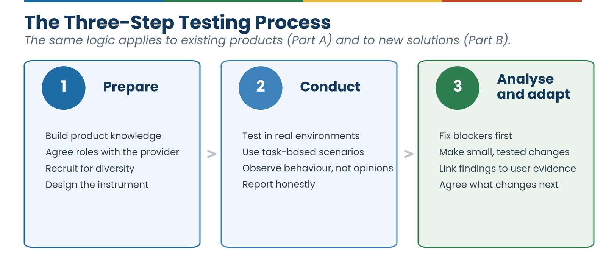
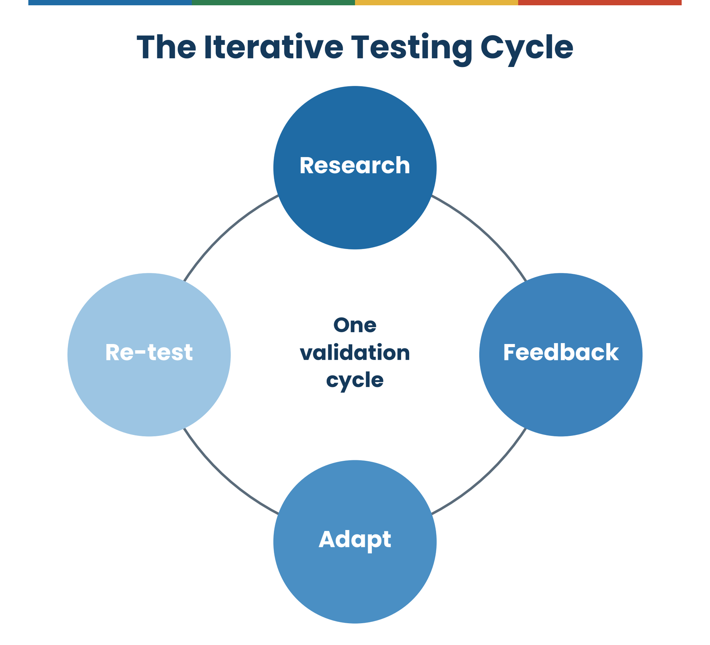
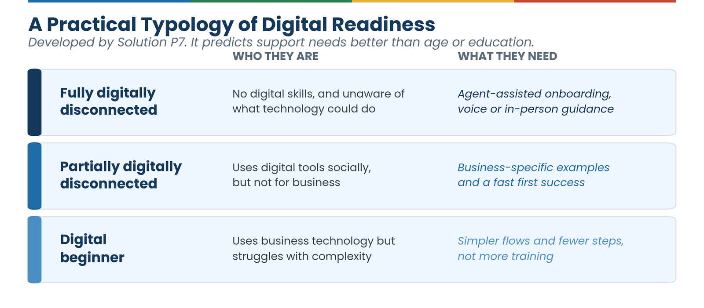

# 4. UI/UX Design Best Practices When Designing for Informal Sector Entrepreneurs

*How to run user testing step by step, for products that exist and products that do not yet.*

The project was implemented in two phases with different starting points for each phase. **Part A** covers user testing and adaptation of existing, already-built digital solutions (Phase 1: the twelve intermediary partnerships described in [Section 1.3](01-introduction.md#13-about-the-project-and-the-intermediary-cohort)). **Part B** covers UI/UX practice for new solutions built from scratch through the project ideation-to-incubation programme (Phase 2). Both follow the same three-step logic (prepare, conduct, analyse and adapt), but the starting point, constraints, and pace differ.

---

## Part A: UI/UX Design for Existing Solutions (Phase 1)

### Step 1: Preparing for User Testing

**Train the intermediary team before fieldwork begins.** The quality of insights from any user research effort depends heavily on the people doing the fieldwork. Organizations that arrived at fieldwork with a solid grounding in user testing methodology, gender-sensitive facilitation, and product knowledge produced far richer findings than those where preparation was rushed.

Training must address both technical and interpersonal dimensions. On the technical side, intermediaries need to understand what usability testing is actually for, how to run a task-based session, how to write neutral observation notes, and how to distinguish between a usability problem and a participant preference. On the interpersonal side, they need to be comfortable working with participants who are cautious, distracted, or uncertain about the process. Intermediary N1's input to this guide was specific: training must ensure intermediaries are adequately knowledgeable not just in user testing concepts but in the business applications of user interfaces relevant to the specific product they are testing. Intermediary N3 added that training must build confidence in iterative testing.

*What training needs to cover:*

- Cover user testing and user research concepts in full before moving to practice.
- Curate focused training materials, including checklists, flowcharts, and illustrated guides.
- Include training on gender and cultural sensitivity.
- Use role-play and practice scenarios; there is no substitute for practising facilitation before doing it for real.
- Train for diverse participant groups. Facilitation approaches must adapt to participants with very limited literacy, strong language preferences, or significant digital anxiety.
- Train intermediaries to document direct quotes and behavioural cues during sessions.

**Understand the product before testing begins.** Intermediary N1's recommendation was direct: product orientation sessions should be in person wherever possible, held at the solution provider's location, and should include hands-on time with the product rather than a slide presentation.

- Require the solution provider to deliver a full product demonstration before testing begins, using real business scenarios relevant to the target users.
- Use plain, non-technical language in product explanations.
- Give the intermediary team sandbox access to explore the product independently.
- Document known limitations. If a feature is still in development or has known bugs, the testing team must know this before interpreting participant behaviour.

**Set up direct communication with the solution provider before testing starts, not after something goes wrong.** In the project, communication gaps between the intermediary and the solution provider (about timelines, expectations, or who was responsible for delivering a testable version of the product) were a recurring source of delay, and in a future engagement without a programme manager coordinating between the two sides, an intermediary cannot rely on that layer to catch the problem. Agree upfront on a check-in cadence and escalation point with the solution provider directly. Intermediary N4's recommendation applies equally outside a managed project: escalate early when a solution provider goes quiet or fails to deliver a testable artefact, rather than absorbing the delay quietly and letting it compress the testing timeline. A regular check-in structure is not administrative overhead; it is how an intermediary protects the quality of its own findings.

**Recruit and prepare participants.** Effective recruitment starts with a clear definition of who you need: not just the target sector, but the range of digital experience, literacy levels, language backgrounds, age ranges, and business types that will give a complete picture of how the solution works across the intended user population. The most useful participant profiles in the project were deliberately diverse; over-relying on participants already comfortable with technology hides the barriers that prevent the majority of the target group from adopting a solution.

Community-embedded recruitment consistently outperformed generic outreach. Market queens, women's savings groups, business associations, and peer referral networks were the most effective channels across all three regions. Intermediary N3, Intermediary N1, and Intermediary A2 all reported that recruiting through established community structures produced participants who were more engaged, more representative, and more willing to give honest feedback.

- Start with your existing network, then expand through peer referral.
- Engage market queens and community leaders as recruitment partners, not just as access facilitators.
- Use trusted institutions: women's cooperatives, savings groups, churches, mosques, and market associations.
- Recruit more participants than the minimum requirement; Intermediary N1, Intermediary N4, and Intermediary A2 all recommended building an attrition buffer.
- Screen for the right mix. Intermediary E1 specifically recommended recruiting a mix of tech-savvy and less tech-savvy participants to capture the full usability picture.
- Prepare participants before sessions with a brief, jargon-free explanation of what usability testing is, why their opinions matter, and that there are no wrong answers. Intermediary N3 noted this reduced participant anxiety and increased the quality of verbal feedback.
- Uphold ethical responsibilities in recruitment: clear consent, anonymisation of all data, transparency about how findings will be used, respect for participants' right to withdraw at any point, and explicit consent before any recording.

**Design research instruments for the participants, not the researcher.** Research instruments should be structured around the participant's understanding of their own work, not around academic research conventions or reporting templates.

- Use open questions first, then structured follow-ups.
- Frame questions around the participant's business activities, not around app features.
- Avoid closed yes/no questions; Intermediary E1 recommended "show me how" or "walk me through" prompts.
- Avoid rating scales with more than three points for lower-literacy participants.
- Pilot every questionnaire with a small group before field use.
- Keep questionnaires to ten to fifteen minutes when combined with hands-on task testing (Intermediary A2). Organise questions from simple to complex, and close with an open prompt such as "What is the one change you would want to see in this app?"
- Combine structured and open methods. Intermediary A2 recommended moving beyond ratings and inviting participants to tell the story of what happened: "Tell us what happened when you tried to…" captures richer insights than "Rate this on a scale of one to five."
- Capture gender-specific dimensions explicitly: privacy from household members, freedom to use a phone during the day, comfort using a financial app in public, time constraints, and confidence levels before and after testing.

### Step 2: Conducting User Testing

The methodology used across the project was grounded in user-centered design principles, adapted for the specific realities of field research with women micro-entrepreneurs in peri-urban Ghana. Key methods applied across the cohort included interviews with women founders and business owners in local languages, contextual inquiry observing daily business routines in real environments, intersectional persona development, task-based usability testing with think-aloud protocols, and co-creation workshops where participants contributed directly to proposed adaptations.

**Maintain the same participant cohort where possible.** Returning users have prior experience with the product and are far better placed to evaluate whether changes have improved it. Intermediary N1 maintained the same cohort of ten women micro-entrepreneurs through to the final Solution S1 validation. This continuity produced particularly clear findings, since participants could point to specific things that had changed and assess whether those changes worked for them.

**Run task-based sessions.** Give participants specific tasks to complete on the product, observe while they complete them, and then ask structured questions.

- Design tasks that test the specific changes made during co-creation.
- Run one-on-one sessions wherever possible.
- Allow thirty to forty-five minutes per session.
- Allow users to try the product independently before guiding them.

Intermediary A1 applied this with Solution S9, structuring tasks around the features most used by agricultural traders: mobile login, stock entry, and inventory updates (the resulting task-completion data, including a 36.4% failure rate on inventory updates, is in [Section 5.1](05-insights.md#51-digital-literacy-and-adoption-patterns)).

**Test in real environments.** Intermediary A2, Intermediary E1, and Intermediary N4 all emphasized that testing in participants' actual work environments (markets, shops, salons, kiosks, not just at hubs or training facilities) reveals barriers that controlled testing misses.

!!! quote "From the field — Intermediary N4 + Solution S4 (Northern Region, 2025)"
    Intermediary N4's validation of the Solution S4 platform included testing in market settings where participants typically conduct business. This context revealed that the time required to compose and send a promotional message was a genuine barrier during busy trading periods. Participants asked for pre-written templates they could send with a single confirmation step. Intermediary N4's recommendation: when a live app is unavailable during testing, use mockups or annotated printouts to ensure the session still yields directional findings.

**Include both early adopters and slower adopters.** Intermediary E1 made a point that is easy to overlook: early adopters tend to be more forgiving of rough edges; slower adopters reveal the barriers that prevent the majority of target users from getting to value. Balanced feedback needs both.

**Combine observation and questioning.** What participants do is often more informative than what they say. Facilitators observed hesitations, workarounds, re-reading of instructions, and points where participants stopped and asked for help: behavioural signals that did not appear in post-session questionnaires.

!!! quote "From the field"
    *"I got through the login, but I do not think I could do it alone at home without someone to ask."*

    — Participant during Intermediary N1 validation exercise, Tamale, 2025.

**Document validation findings rigorously.** Validation reports are evidence records, not marketing documents. State validation objectives clearly at the start. Report task completion rates for each task tested. Include direct participant quotes and visual evidence (before/after screenshots, session photos). Include all referenced appendices.

!!! warning "Common mistake: reporting only the positive findings"
    A validation report that omits the 36.4% task-failure rate because the 100% login-success rate looks better is not a validation report; it is marketing, and it will not help the solution provider fix what is actually broken. Report what happened, not what reflects best on the test.

### Step 3: Analysing Results and Adapting UI/UX

**Link every recommendation to user evidence.** Every recommendation made to a solution provider should trace back to something a participant did or said. Vague recommendations like "improve the interface" rarely produce useful action; specific, evidence-backed recommendations do. The structure that proved most effective was: *"User feedback indicated [issue]. This led us to recommend [specific change]."* Intermediary N1 used this structure throughout their Solution S1 co-creation documentation.

!!! quote "Co-creation example — Intermediary N1 + Solution S1"
    **User feedback indicated:** password creation caused errors and prevented women from completing registration.

    **Recommendation:** simplify the default password requirements.

    **Change implemented:** predetermined password system with simpler requirements.

    **Validation result:** every participant in the follow-up testing completed login without errors. *"This time I got in within less than a minute."*

**Prioritize what to adapt.** Not everything can be changed at once, and solution providers need help prioritizing. The most important changes are those that block core usage: login failures, navigation dead-ends, error messages that cannot be dismissed. After those come changes that significantly reduce confidence or satisfaction. Aesthetic preferences come last.

- Identify blockers first: any issue preventing task completion must be resolved before anything else.
- Separate design preferences from usability problems.
- Be realistic about what a solution provider can change within the project timeframe.
- Document all findings, even those that cannot be acted on immediately.

**Build a culture of small changes.** One of the clearest lessons from the project is that small, well-targeted improvements consistently outperformed large redesigns. When a solution provider addressed multiple issues at once, quality suffered; when they focused on one or two specific changes and tested them rigorously, the results held up in validation. Incremental improvement should start with whatever is preventing women from completing basic tasks; in this project, that meant simplified logins, legible fonts, and offline functionality appearing as early priorities across multiple partnerships. Intermediary E1 added a point that is often underweighted: fix bugs before anything else, since unresolved bugs undermine trust rapidly among first-time users.

!!! quote "From the field"
    *"Even though I use reading glasses, I can read this clearly without squinting."*

    — Validation participant on the adapted Solution S1 typography, Tamale, 2025.

**Provide pre-built, adaptable templates** for common tasks rather than a blank canvas; Intermediary N4's experience with Solution S4 showed women entrepreneurs are more likely to adopt a communication tool with ready-made templates they can customise. Test every change before moving on: run quick field trials with small groups, compare before-and-after performance (task completion, time on task, error counts), and observe as well as ask, since what participants say they found easy and what they actually found easy are sometimes different. Treat user confidence as a goal in itself, not just task completion: a participant who says "I think I did it right" has had a different experience from one who says "Yes, I know exactly what happened," and confidence is closely tied to adoption. Document what changed and why for every co-creation cycle.

**When providers are reluctant, slow, or unable to change.** Resistance from solution providers happened in some partnerships. The most effective response was to return to the evidence: specific quotes, observation notes, and task completion rates. Intermediary N2's partnership raised a structural challenge: solution providers with limited financial capacity who genuinely could not commit the development resources needed to act on co-creation feedback. This is a project design issue; provider readiness assessment before selection should include an honest evaluation of development capacity, not just intent. Intermediary N4 raised a related accountability concern: when solution providers fail to deliver testable artefacts on time, the intermediary's work is blocked. Their recommendation was that intermediaries should escalate quickly rather than absorb delays quietly, and that even when a provider fails to deliver, the intermediary should document what would have been tested.

---

## Part B: UI/UX Design for New Solutions (Phase 2)

Phase 2 tested a different kind of assumption. There was no existing product with real users to observe, only a problem hypothesis, and later a prototype, being validated for the first time. **In Phase 2 the promise was tested before the product fully existed.**

### Step 1: Preparing for User Testing (new solutions)

**Test the problem before testing the product.** Every Phase 2 team structured its validation around explicit, written assumptions in three tiers (problem assumptions, solution assumptions, and business-model assumptions), stated before fieldwork began and scored afterward as validated, partially validated, or not validated. This discipline is what Part A's training curriculum produces for testing an existing product; for a new solution, the same discipline has to be applied one step earlier, to the problem itself. Solution P2's team, for example, went into the field with the explicit hypothesis that "a simple USSD-based coordination system can reduce delays in accessing veterinarians", a solution assumption they could confirm or reject rather than a vague intention to "test the app."

**Recruit without an existing user base.** Phase 1 intermediaries recruited through networks the solution provider or intermediary already had (Part A, Step 1). Phase 2 teams by definition had no prior users, so recruitment leaned more heavily on the intermediary's own community standing: Solution P1's team worked through artisan associations in three Upper East towns; Solution P5 and Solution P6's team recruited through existing savings groups and market networks in Tamale; Solution P2's team worked through women's cooperatives in three named communities in Builsa North. Where a solution targeted a specific occupational identity (livestock farmers, artisans, savings-group members), recruiting through the trade or association structure that identity already had, rather than general public outreach, was consistently how teams found participants who could speak to the problem with authority.

**Define literacy and digital-experience segments explicitly, not just demographics.** Solution P7's team went further than most in operationalizing this: participants were classified as "Fully Digitally-Disconnected" (no digital skills, no awareness of what technology could do for their business), "Partially Digitally-Disconnected" (comfortable with digital tools socially but not for business), or "Digital Beginner" (uses business technology but struggles with complexity). This typology is worth adopting more broadly: it predicts what kind of support a participant will need far better than age or education level alone, echoing the Phase 1 finding that literacy does not correlate with business acumen ([Section 2.1.3](02-understanding-users.md#213-digital-literacy-and-business-acumen)).

### Step 2: Conducting User Testing (new solutions)

**Match the testing method to what actually exists.** Phase 2 teams tested at very different levels of product maturity, and adapted method accordingly: Solution P5 ran guided task-based sessions on a working iOS app distributed via TestFlight; Solution P2 combined a live website demonstration with a structured role-play, where a team member played the part of a dispatched veterinarian and physically arrived at the agreed time so participants could experience what the promise would feel like; Solution P1 combined in-person and phone structured interviews with live MVP demonstration for participants who had smartphones, and demonstration-plus-verbal-feedback for a participant who did not own one. None of these teams waited for a finished product before testing. The role-play approach in particular is a low-cost way to validate a service-delivery promise (not just an interface) before any code is written.

**Watch for the gap between stated interest and structural exclusion.** Solution P1's testing surfaced a participant who was highly motivated and articulate about the problem but could not use the platform at all because she had no smartphone access, a finding the team correctly treated not as a disqualifying edge case but as a structural exclusion issue requiring its own solution (an agent-assisted onboarding model), consistent with the Phase 1 principle of accessibility as a standard requirement rather than a special case ([Section 3.3](03-principles.md#33-accessibility-and-inclusion)).

**Let participants react to a concrete promise, not an abstract concept.** The strongest signal across Phase 2 testing came from making the value proposition specific and checkable. When Solution P2 showed a booking confirmation with a specific arrival time, one farmer's reaction was immediate and telling: *"It tells me exactly when he will come? And he WILL come?"* Vague descriptions of "a platform that connects you to vets" would not have produced that reaction or the skepticism that followed it; both are more useful than polite general approval.

### Step 3: Analysing Results and Adapting UI/UX (new solutions)

**Distinguish "the problem is real" from "this solution addresses it."** Every Phase 2 validation report scored these separately, and the two did not always move together. Solution P5's problem and solution assumptions were both strongly validated. Solution P4's problem assumption was strongly validated (farmers have normalized unsafe self-medication because they have given up on formal veterinary access) but the solution only partially addressed it: the underlying constraint turned out to be too few participating veterinarians, not the coordination mechanism itself. Treating these as separate questions, the way Phase 1's evidence-linkage discipline treats specific usability findings separately from overall product viability (Part A, Step 3), keeps a team from either abandoning a valid problem because the first solution attempt was imperfect, or persisting with a solution the evidence does not support.

**Take feature requests that exceed the MVP's scope seriously; they are evidence, not scope creep.** Solution P7 was deliberately built as a minimal three-action tool (record a sale, record an expense, view a summary), and it worked: participants completed the core flow and understood its value. But the same participants immediately asked for invoicing, point-of-sale, and receipt generation: features well beyond the MVP. Solution P5's beta users, similarly, asked for credit scoring and savings tracking beyond the crowdfunding feature they were testing. Read together, these are not two teams that under-scoped their MVPs; they are a consistent signal that once this user group trusts a simple tool enough to adopt it, they want it to grow into a fuller business platform. That is a roadmap finding, not a reason to have built more before testing. Solution P7's team was correct to launch minimal first and let demand for complexity surface through evidence rather than assumption.

**Price against the specific alternative, not in the abstract.** Willingness-to-pay data across Phase 2 was strongest where teams anchored pricing to the cost of what participants already tolerated. Solution P5's 5% platform fee tested well specifically because participants compared it to the 40–60% rates charged by informal lenders they currently used, not to an abstract notion of "a reasonable fee." Solution P2's farmers, by contrast, resisted any upfront payment regardless of amount, because the specific alternative they feared was paying and then having no vet arrive; the objection was about payment sequencing and trust, not price level, which is why shifting to pay-after-service (and, for Solution P4's veterinarians, a platform-held escrow model) addressed it where a lower price would not have.

Solution P11's validation added two further pricing findings at larger scale. First, bundling raised willingness to contribute: insurance, micro-pension savings, advisory services, and post-loss recovery support offered through one trusted platform read as more valuable to participants than any of those products alone, and farmers valued recovery support after a loss almost as highly as the insurance payout itself, a reminder that what this user group is buying is resilience, not a policy. Second, contribution flexibility mattered as much as the amount: schedules matched to seasonal farm incomes, paid in small instalments over USSD, made commitment possible for participants for whom a fixed monthly fee would not have.

**Expect trust, not features, to be the binding constraint for service-coordination solutions.** Solution P2 and Solution P4 both connect farmers to a human service provider (a veterinarian) rather than digitizing a task the user already does alone, and both encountered the same core barrier: years of unreliable informal alternatives had taught participants to expect no-shows, so the product had to overcome scepticism before its features mattered at all. Solution P4's assessment stated this directly: "trust and proof of effectiveness will determine adoption". Both teams' next steps centred on visible, bounded pilots (a defined response-time target, a small committed cohort) designed to generate the first success stories rather than on adding product features. This is a distinct pattern from Phase 1, where the binding constraint was more often a specific interface friction ([Section 5.3](05-insights.md#53-task-completion-and-friction-points)); for a new two-sided service marketplace, the constraint is more often reputational, and no interface change fixes it faster than a demonstrated track record does.

!!! quote "From the field"
    *"When animals fall sick, we don't call anyone, because we know the vet won't come. By the time help comes, the animal is already dead."*

    — Farmer participants, Solution P4 validation, Asante Akim South District, 2026.

Solution P4's follow-up validation, run in January 2026 with thirty farmers and five veterinary professionals in Asante Akim South District, added a supply-side dimension to this pattern. The three-step USSD request flow itself worked: registration needed hands-on assistance, but most farmers could then submit requests independently, and they valued reaching several trained professionals at once instead of hunting for individual phone numbers. The main interface complaint was simply that the USSD shortcode was too long to remember easily. The real bottlenecks sat on the service side: the veterinarian pool was small, the system allowed a vet to accept only one request at a time, and vets showed a preference for giving remote advice over travelling to farms, all of which undermined the response-time reliability that farmer trust depends on.

The revenue insight ran in the same direction. Vets were hesitant to pay for access to farmers, since demand already exceeded their capacity, but showed strong interest in paying for data analytics, case summaries, and periodic activity reports. For a two-sided service marketplace, the side that needs the platform most is not automatically the side that will pay for it, and the stronger paying proposition may be data, not leads. The team's planned response follows the bounded-pilot pattern above: a structured three-month pilot with defined service-level targets, aggregation of requests by community so that one vet trip serves several farmers, emergency prioritization, and a response-time target under 24 hours.
