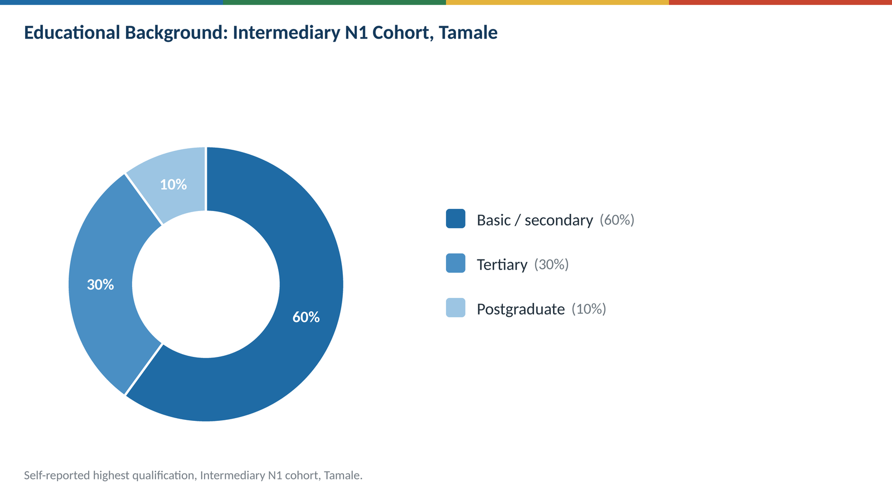
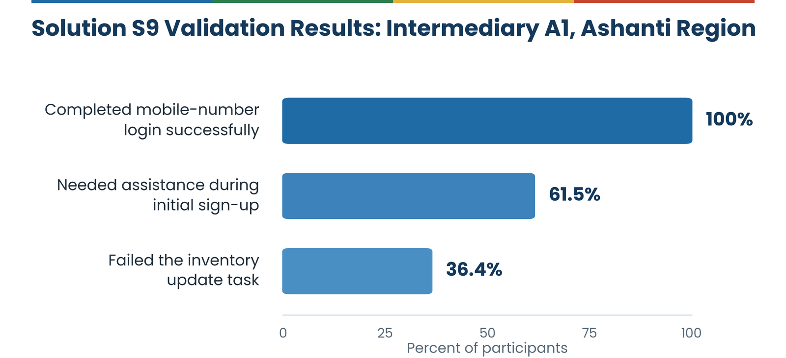
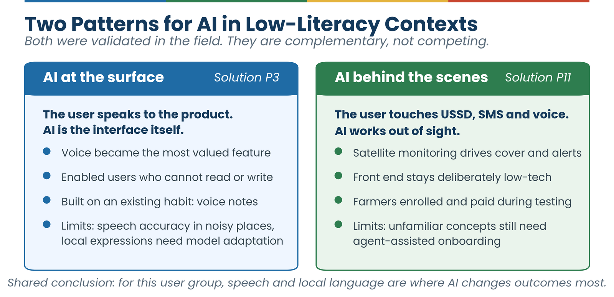

# 5. Insights and Learnings

*What the field work actually showed, including what did not work.*

Three years of fieldwork across the full project cohort (the six regions, fourteen intermediaries, and thirty solutions introduced in [Section 1.3](01-introduction.md#13-about-the-project-and-the-intermediary-cohort)) produced a consistent message: the gap between a digital product and the women it is supposed to serve is almost never a technology gap. It is a design gap, a communication gap, and sometimes a commitment gap.

The products that worked better at the end of the project than at the start did not become different products; they became more specific to their users. Simpler logins, bigger text, support in local languages, pre-written templates, offline capabilities, and a phone number to call when something goes wrong. These are not complex innovations. They are the basics of designing for a real person in a real context.

What is harder than the design changes is the process that produces them: genuinely listening to users, building enough trust that participants will tell you when something does not work, maintaining that feedback loop over time, and having solution providers who are willing to act on what they hear. The Intermediary N2 and Intermediary N4 partnerships documented what happens when provider capacity or commitment is insufficient. The Intermediary N1 and Intermediary A2 partnerships documented what is possible when the collaboration is genuine.

## 5.1 Digital Literacy and Adoption Patterns

Digital literacy across the project's participant pool was more heterogeneous than initial assumptions suggested. Intermediary N1's cohort in Tamale showed 60 percent with basic or secondary education, 30 percent tertiary, and 10 percent postgraduate qualifications. These educational categories did not predict digital confidence reliably.

Intermediary A1's Solution S9 data provided some of the most precise field metrics in the project:

- **100% of participants successfully completed mobile-number-based login**, confirming that this is the right authentication approach for this population.
- **61.5% needed assistance during initial sign-up**, indicating that standard onboarding flows are not yet calibrated for this user group.
- **36.4% failed the inventory update task**, directly attributable to interface complexity and small tap targets.
- **5 participants independently requested voice guidance features**, representing a consistent and unprompted signal about a significant accessibility gap.

## 5.2 Language and Localization Evidence

The language data from this project is unambiguous. In every region, participants engaged more deeply, gave more honest feedback, and completed tasks more successfully when sessions were conducted in their first language. Intermediary E3's validation sessions in the Eastern Region used four languages: Twi, Dangme, Ewe, and English. The multilingual approach was not a logistical complication; it was what made the findings representative. Single-language testing in English would have systematically excluded the participants most likely to represent the barriers the project was trying to address.

## 5.3 Task Completion and Friction Points

Across all partnerships, the tasks with the highest failure rates shared a common characteristic: they involved either account creation, multi-step navigation, or interface elements too small for reliable use on older devices. These are not edge cases; they are the core onboarding and daily-use flows that determine whether a product is adopted at all.

The most consistently successful tasks were those involving a single action with an immediate visible outcome: recording a payment, sending a message, or viewing a product price. These one-step flows had near-universal completion rates across literacy and digital experience levels. This is the design benchmark all core features should aspire to.

## 5.4 Co-Creation Impact: Before and After

Where before-and-after data was available, the impact of co-creation adaptations was measurable and consistent. The Intermediary N1 / Solution S1 co-creation cycle produced the most documented improvement in the project: a password simplification that moved login from a common point of failure to a near-universal success in the validation phase.

The pattern repeated across other partnerships. Where specific, evidence-backed changes were implemented before validation, task completion rates improved and user confidence scores increased. Where the co-creation phase was compressed or where providers were unable to implement changes, validation data showed little improvement from the baseline.

This data makes a clear argument for adequate time and genuine provider commitment in co-creation phases: it is the portion of the project cycle that converts research into measurable impact.

## 5.5 Key Behavioural Observations

Across all field sites, facilitators documented consistent behavioural patterns that structured survey data alone would not have captured:

- Participants who encountered their first unfamiliar interface element often stopped and looked to the facilitator before attempting to proceed, even when they had been told they could try freely. This confirms the need for confidence-building in onboarding.
- When confirmation messages appeared after a successful action, participants visibly relaxed. The absence of confirmation caused repeated actions and anxiety about whether tasks had been completed.
- Participants consistently found ways to describe a digital tool's value in terms of their existing business practices. A tool was "like my notebook but faster" or "like mobile money but for stock." Designers should build on, not replace, these mental models.
- Women who participated in group sessions were more likely to compare experiences and point out usability differences than those in one-on-one settings, making group sessions particularly valuable for surface-level issue identification.

## 5.6 Phase 1 and Phase 2: What Carried Over, What Differed

Testing an existing product (Phase 1) and testing a brand-new one (Phase 2, [Section 4 Part B](04-design-practices.md#part-b-uiux-design-for-new-solutions-phase-2)) are different exercises, but the project evidence shows the same underlying principles governed both.

**What carried over.** Trust was the binding constraint in both phases, not technical sophistication. Phase 1's Intermediary N1 / Solution S1 password fix and Phase 2's Solution P2 booking-confirmation reaction are, structurally, the same finding: a small, concrete, verifiable promise did more for adoption than any amount of feature depth. Local language and voice interaction moved from "accessibility feature" to "core requirement" in both phases; Phase 1's language findings (Section 5.2) and Phase 2's Solution P3, where voice input started as a secondary feature and became the most-valued one, reached the same conclusion independently. And in both phases, the most reliable recruitment channel was an existing community structure the intermediary or team already had standing in, not general outreach. Solution P11's validation later confirmed this at the largest scale in the project: more than five hundred women farmers reached through Farmer-Based Organizations and community leaders, with community trust proving a stronger driver of adoption than the technology itself.

**What differed.** Phase 2 teams could test a specific, falsifiable promise before a product fully existed (a role-play, a demo, a paper flow) in a way Phase 1's adaptation work, constrained by whatever the existing product already was, could not. This let Phase 2 validate or reject a business model earlier and more cheaply. Phase 2 also surfaced a pattern Phase 1's evidence base did not clearly show: users who adopt a deliberately minimal tool quickly ask for more capability once they trust it (Solution P7, Solution P5): a "start minimal, then earn the right to add complexity" dynamic that is a useful complement to Phase 1's "small changes, tested rigorously" discipline ([Section 4, Part A, Step 3](04-design-practices.md#step-3-analysing-results-and-adapting-uiux)), not a contradiction of it.

## 5.7 Limitations and Ethical Considerations

This guide is grounded in three years of field activity, but it has boundaries. Understanding those boundaries is essential for applying the guidance responsibly.

**Scope limitations.** The findings in this guide reflect a specific project context: fourteen intermediary organizations, thirty digital solutions across Phase 1 and Phase 2, six regions of Ghana, and a participant population of women micro-entrepreneurs in peri-urban and rural settings between 2023 and 2026.

- **Context-specificity.** Findings from Tamale do not automatically transfer to Kumasi, and findings from Ghana do not automatically transfer to other countries. Practitioners applying this guidance elsewhere must conduct their own baseline research.
- **Solution mix.** The solutions tested were weighted toward business management, payments, and agricultural e-commerce. Sectors not represented, including health, education, and creative industries, may present different design challenges.
- **Participant selection.** Participants were recruited through community networks and intermediary relationships. This may have produced cohorts that were more digitally engaged than the full population of women micro-entrepreneurs in each area.
- **Project timeline.** Some solutions were still in development during testing. Findings about incomplete products reflect a snapshot in time and should be interpreted as directional rather than definitive.
- **Depth of evidence varies by solution.** Solutions S1–S11, P1–P7, and P11 have full field validation reports behind them (quotes, task-completion data, iteration history). Solutions S12–S18, P8–P10, and P12 (eleven solutions in total, added in this edition) are documented at roster level only (name, region, status, brief description), since no validation-report-level detail was available in the project's records at the time of writing. Treat roster-level entries as confirmed to exist, not as evidence of specific usability findings.

**Ethical responsibilities.** Practitioners using this guide to design or research digital solutions have ethical responsibilities that go beyond the technical guidance provided here:

- **Informed consent.** All research participants must understand what they are participating in, how their data will be used, and their right to withdraw. This is not a procedural formality; it is the foundation of research that respects participants' autonomy.
- **Data privacy.** Research data collected from women participants must be stored securely, anonymised in publications, and not shared with third parties without explicit consent. This applies to quotes, images, and demographic information.
- **Power dynamics.** Researchers from outside a community hold a degree of power over participants that can distort findings if not actively managed. Facilitation approaches should equalize, not amplify, power differences.
- **Representation.** Findings should not be generalized beyond the evidence. Saying "women in Northern Ghana prefer X" based on a cohort of fifteen participants in Tamale overstates both the evidence and the homogeneity of the population.
- **Do no harm.** Research activities and product deployments should not expose participants to financial, reputational, or privacy risk. Where a solution has known limitations, participants must be informed before use.

**Designing with context awareness.** The most important ethical principle in this space is humility: recognizing that designing for users whose context differs from your own requires active effort to understand that context rather than projecting assumptions onto it. This guide provides evidence from the field. It does not remove the responsibility to go to the field yourself, listen carefully, and adapt. The women who participated in the project gave their time and their honesty precisely because they wanted better tools. Practitioners who use this guide carry a responsibility to honour that investment.

## 5.8 AI in This Project: Evidence and Open Questions

Artificial Intelligence (AI) appears in this project's record in a small but growing set of solutions. In Phase 1, Solution S13, an AI chatbot for business communications, is documented at roster level only. In Phase 2, five solutions carry an AI component: Solution P3's bookkeeping application is built around an AI speech interface; Solution P10 combines financial record-keeping with voice prompts for low-literacy users; Solution P11, the closing pitch event's first-placed finalist, applies AI-powered satellite monitoring to crop and climate risk assessment in its agricultural insurance platform; Solution P9 uses AI in mobile money fraud verification; and Solution P8 uses AI for agricultural service matching. Of these, Solutions P3 and P11 carry full field validation evidence in this edition, and their findings point in usefully different directions.

**Solution P3: AI at the surface.** Solution P3's validation is the project's clearest evidence that AI can remove barriers for this user group rather than add them. Voice interaction was not the MVP's original primary focus, yet it became the most valued feature in testing. Speaking to the application reduced friction, increased confidence during use, and enabled participation by users who could not read or write; participants also connected it naturally to an existing habit, sending voice notes on WhatsApp. Where voice guidance was available, participants navigated successfully; where it was limited, they got stuck. Participants asked for deeper conversational interaction, such as hearing account balances and transaction summaries spoken back to them, and approximately 80% of the seven participants indicated willingness to pay if the tool demonstrably improved their business organization, although payments were not enforced during testing, so that commercial signal remains unproven. The team's resulting decision was to raise voice-based workflows to roughly 90% of user interactions.

The same validation exercise documents the AI-specific work this requires. Speech recognition accuracy dropped when audio clarity was low, a real constraint in the markets and workshops where this user group works. Local business expressions and informal ways of stating amounts required adaptation of the underlying model; an off-the-shelf speech model does not arrive understanding how a Ghanaian trader phrases a credit sale. And connectivity still affected some features despite partial offline capability, which matters because speech processing tends to depend on a connection precisely for the users that offline functionality is meant to protect.

**Solution P11: AI behind the scenes.** Solution P11 demonstrates a second, complementary pattern: AI in the back end, simplicity at the front. Its validation, run in early 2026 with more than five hundred women smallholder farmers through community sensitization meetings, product demonstrations, interviews, and focus group discussions, tested a platform whose AI works invisibly, in satellite-based monitoring of crop and climate risk that drives insurance cover and early-warning advisories. What farmers actually touch is deliberately low-tech: USSD enrolment, SMS alerts, automated voice advisories in local languages, and field agents for assisted onboarding. Among the features drawing the strongest response were the local-language voice advisories and climate early warnings, and participants asked for advisory coverage in more local languages than the platform currently supported, the same direction of demand documented for Solution P3. During the validation period itself, farmers began enrolling and making small contributions through the USSD channel: early evidence that the value AI generates reaches this user group most reliably through the simplest available channels.

The demand signal extends well beyond one solution. Five of Intermediary A1's participants independently requested voice guidance during Solution S9 testing (Section 5.1). Older farmers in Solution P4's validation struggled with USSD menus and asked for a voice version of the service. And local language moved from accessibility feature to core requirement in both phases (Sections 5.2 and 5.6). Read together, these findings point to one conclusion: **for low-literacy users, speech interaction in local languages is the most consequential application of AI this project observed**, well ahead of more visible uses such as chatbots.

None of this exempts an AI feature from the tests this user group applies to every tool: visible value within the first few uses, reliable behaviour on low-end devices and unstable connectivity, trustworthy handling of money and data, and availability in the user's language ([Sections 2](02-understanding-users.md) and [3](03-principles.md)). A guided voice flow that reliably records a sale is worth more than an open-ended assistant that sometimes misunderstands one. Field evidence on AI-enabled solutions, including validation data for Solutions S13, P8, P9, and P10 as they mature, is a priority contribution area for future editions of this guide ([Section 9.1](09-sustaining.md#91-what-to-contribute)).
