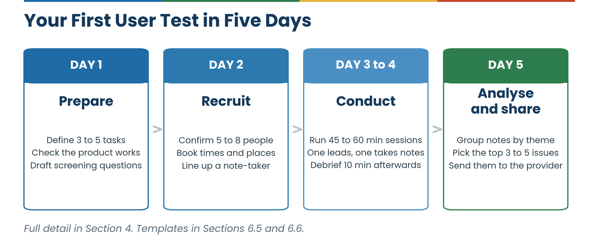

---
hide:
  - navigation
  - toc
---

  

    
  

  

    
First Edition · Accra 2026 · CC BY 4.0

    <h1 class="dteg-hero__title">Designing inclusive digital solutions</h1>
    
An open-source UI/UX guide for designing context-aware and gender-responsive digital solutions in Ghana. Built from three years of field testing with informal entrepreneurs.

    

      <a class="dteg-btn dteg-btn--primary" href="#quick-start">Run your first test in 5 days &rarr;</a>
      <a class="dteg-btn dteg-btn--ghost" href="#key-findings">Read the key findings</a>
    

    

      
2023&ndash;26Three years of project work

      
6Regions across both phases

      
18Existing products adapted, Phase 1

      
12New ideas validated, Phase 2

    

  

## About This Guide

The Open-Source Guide is the final output of more than three years of work done on the project *User Testing and Support to the Adaptation of Digital Solutions for Informal Micro-Entrepreneurs* (2023–2026). The Project launched by GIZ was implemented under the Digital Transformation for Inclusive Entrepreneurship in Ghana (DTEG) programme to promote inclusive digital transformation by ensuring that digital solutions are designed around the needs of informal micro-entrepreneurs, particularly women-led enterprises.

Recognizing that many existing digital products fail to address the realities of informal businesses — including low digital literacy, limited connectivity, affordability constraints, and cultural context — the project adopted a user-centred design approach to improve the relevance, accessibility, and adoption of digital technologies.

This guide translates strategies and insights from field-based user research, usability testing, innovation and co-creation activities conducted under the project into practical guidance for those designing or adapting digital solutions for informal sector entrepreneurs in Ghana. It synthesizes learnings from across the project, covering the Upper East, Northern, Eastern, and Ashanti regions of Ghana in Phase 1, and extending into Upper West and North East Region in Phase 2. It draws on validation reports, co-creation records, Open-Source Guide input submissions, field observations, and direct contributions from all participating intermediary organizations.

All findings and recommendations presented in this guide trace directly to documented project activity. To protect participant, intermediary, and solution-provider privacy ahead of open-source publication, this edition generalizes and anonymizes examples throughout: no individual participant, staff member, or founder is named, and intermediary organizations and the solutions they tested are referred to by consistent reference codes (for example, "Intermediary N1" and "Solution S1") rather than by name. Region, sector, and the substance of each finding are preserved in full; only identifying names are removed. [Section 1.3](01-introduction.md#13-about-the-project-and-the-intermediary-cohort) explains the coding scheme.

The guide is intended to be practical, honest, and specific. It does not summarize international design literature. It reports what happened in the field: what worked, what did not, and why.

## How to Use This Document

Pick the row that describes you. Sections 3, 6, and 7 are written as standing references &mdash; return to them at any stage of a project, not only when the guide's narrative order reaches them.

  

    <button class="dteg-router__role" role="tab" aria-selected="true" data-role="0">A hub or intermediary new to running user testing</button>
    <button class="dteg-router__role" role="tab" aria-selected="false" data-role="1">A hub considering offering user testing as a paid service</button>
    <button class="dteg-router__role" role="tab" aria-selected="false" data-role="2">A startup or solution provider preparing for user testing</button>
    <button class="dteg-router__role" role="tab" aria-selected="false" data-role="3">A designer or developer adapting an existing product</button>
    <button class="dteg-router__role" role="tab" aria-selected="false" data-role="4">A GIZ, donor, or government stakeholder reviewing project results</button>
    <button class="dteg-router__role" role="tab" aria-selected="false" data-role="5">Someone designing a new digital product from the ground up</button>
    <button class="dteg-router__role" role="tab" aria-selected="false" data-role="6">Anyone wanting to contribute to or maintain this guide</button>
  

  

    
Recommended route

    
A hub or intermediary new to running user testing

    

      Start with
      Section 1 and Section 2
    

    

      Then read
      Section 4, Part A (Steps 1–3); Section 6
    

  

Throughout the guide, colour-coded boxes flag three kinds of content: green boxes hold practical tips, blue boxes hold testimonials and observations from the field, and amber boxes flag common mistakes to avoid.

## Key Findings at a Glance {: #key-findings }

A summary of the key findings for a general read before diving into the full sections. It is a compressed summary of Section 5, not a substitute for it.

  <article class="dteg-finding">
01
<h3>Trust, not technical sophistication, was the biggest driver of adoption</h3>
A small, verifiable promise — a fixed password flow, a specific booking time — did more for uptake than any amount of feature depth.

Section 5.6
</article>
  <article class="dteg-finding">
02
<h3>Language and literacy were the highest-leverage fixes available</h3>
Solutions tested in participants' first language consistently produced more honest feedback and higher task completion than English-only equivalents.

Section 5.2
</article>
  <article class="dteg-finding">
03
<h3>Small, evidence-backed changes consistently beat large redesigns</h3>
The clearest documented improvement in the project came from one targeted fix, not a rebuild.

Section 5.4
</article>
  <article class="dteg-finding">
04
<h3>Accessibility fixes helped everyone, not just the group they targeted</h3>
Larger text, simplified navigation and voice guidance measurably benefited users with no stated accessibility need.

Sections 3.3, 5.5
</article>
  <article class="dteg-finding">
05
<h3>Co-creation only improved products where providers could act on findings</h3>
Provider readiness turned out to matter as much as the quality of the research itself.

Sections 5.4, 5.7
</article>
  <article class="dteg-finding">
06
<h3>The same principles held across two very different tracks</h3>
Adapting eighteen existing products and validating twelve new ideas before they fully existed, despite different constraints, pace, and starting points.

Section 5.6
</article>

## Quick Start: Running Your First User Test in 5 Days {: #quick-start }

If this is your first time running a test and you do not have time to read the full guide first, start here. This gets you through one complete test. Come back to the full section once you've run a session; the details will make more sense with a real test behind you.

  

    

      <button class="dteg-day" role="tab" aria-selected="true" data-day="0">Day 1 · Prepare</button>
      <button class="dteg-day" role="tab" aria-selected="false" data-day="1">Day 2 · Recruit and set logistics</button>
      <button class="dteg-day" role="tab" aria-selected="false" data-day="2">Day 3–4 · Conduct sessions</button>
      <button class="dteg-day" role="tab" aria-selected="false" data-day="3">Day 5 · Analyze and share</button>
    

    

      
<strong data-day-focus>Prepare</strong> Day 1

      
Define 3–5 concrete tasks you want participants to attempt. Confirm the solution/prototype works end to end. Write your screening questions.

      
Go deeper Section 4, Part A/B, Step 1; Screening Template

    

  

  <aside class="dteg-checklist" data-dteg-checklist>
    
<strong>Before you start</strong> 0 of 5 ready

    

    <button class="dteg-check" aria-pressed="false">Access to the solution or prototype idea you're testing (working login, test account, or clickable prototype)</button>
    <button class="dteg-check" aria-pressed="false">At least 5 people who match your target user profile: not staff, not friends, not anyone already familiar with the product</button>
    <button class="dteg-check" aria-pressed="false">A quiet space to run sessions, in person or by phone</button>
    <button class="dteg-check" aria-pressed="false">A way to take notes during the session (paper, phone, laptop, whatever you'll actually use consistently)</button>
    <button class="dteg-check" aria-pressed="false">Permission from each participant to take notes on the session (see the Screening Template for the wording)</button>
    
If any of these are missing, get them in place before scheduling anything; a rushed test without them produces data you can't trust.

  </aside>

!!! warning "Common mistakes that undermine a first test"
    Testing with the wrong people (colleagues, friends, or anyone who already knows how the product works, or who may hesitate to provide honest feedback for fear of disappointing you) will not reflect a real new user. Leading questions ("Was that easy to use?" instead of "Walk me through what you'd do next") get you agreement, not information. Skipping the debrief lets details fade fast, when a 10-minute team debrief right after each session would have captured far more. And running a test without sharing what you found has no impact, however well it was run: a finding that never reaches the solution provider changed nothing.

This Quick Start deliberately leaves out screening rigor, bias mitigation, and the differences between testing an existing product (Part A) versus a brand-new one (Part B). Section 4 covers all of that in full once you're ready for it.

## The Guide, Section by Section

  <a class="dteg-card" href="01-introduction/">1ContextIntroduction and BackgroundWhat the project set out to do, how it ran, and the coding scheme used throughout.</a>
  <a class="dteg-card" href="02-understanding-users/">2ContextUnderstanding the UsersWho the entrepreneurs are, region by region, and how digital readiness varies.</a>
  <a class="dteg-card" href="03-principles/">3Standing referencePrinciples for Gender-Responsive DesignPrinciples to design against, with field evidence for each.</a>
  <a class="dteg-card" href="04-design-practices/">4MethodUI/UX Design Best PracticesThe full method: Part A for existing products, Part B for new ideas.</a>
  <a class="dteg-card" href="05-insights/">5EvidenceInsights and LearningsWhat worked, what did not, and why — the evidence behind the findings.</a>
  <a class="dteg-card" href="06-toolkit/">6Standing referenceOpen-Source Toolkit and ResourcesTemplates, scripts and checklists you can copy and run with.</a>
  <a class="dteg-card" href="07-recommendations/">7Standing referenceRecommendationsWhat hubs, providers and funders should do differently next.</a>
  <a class="dteg-card" href="08-business-model/">8MethodOffering User Testing as a BusinessPricing, packaging and capacity for hubs turning testing into a service.</a>
  <a class="dteg-card" href="09-sustaining/">9GovernanceSustaining the Open-Source GuideHow the guide is maintained, licensed and contributed to.</a>

  

    
Open source

    <h2>This guide is meant to be used, adapted and added to</h2>
    
Published under a Creative Commons Attribution 4.0 International (CC BY 4.0) licence. Photographs, logos, and third-party figures are excluded from the licence. See the Imprint and Section 9.5 for full terms and attribution wording.

    

      <a class="dteg-btn dteg-btn--blue" href="09-sustaining/">Contribute to the guide</a>
      <a class="dteg-btn dteg-btn--outline" href="imprint/">Imprint and licence</a>
    

  

  

