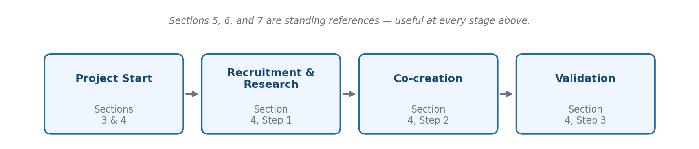

# OPEN-SOURCE UI/UX GUIDE FOR GENDER-RESPONSIVE DIGITAL SOLUTIONS IN GHANA

## About This Guide

This guide distills field-based user research, usability testing, and co-creation work carried out under the DTEG (User-Testing and support to the adaptation of digital solutions for informal entrepreneurs) project into practical guidance for anyone designing or adapting digital solutions for entrepreneurs in Ghana.

It synthesizes learnings from across the DTEG project, covering the Upper East, Northern, Eastern, and Ashanti regions of Ghana in Phase 1, and extending into Upper West and North East Region in Phase 2. It draws on validation reports, co-creation records, Open-Source Guide input submissions, field observations, and direct contributions from all participating intermediary organizations.

All findings and recommendations presented in this guide trace directly to documented DTEG project activity. To protect participant, intermediary, and solution-provider confidentiality ahead of open-source publication, this edition generalizes and anonymizes examples throughout: no individual participant, staff member, or founder is named, and intermediary organizations and the solutions they tested are referred to by consistent reference codes (for example, "Intermediary N1" and "Solution S1") rather than by name. Region, sector, and the substance of each finding are preserved in full — only identifying names are removed. Section 1.3 explains the coding scheme.

The guide is intended to be practical, honest, and specific. It does not summarize international design literature. It reports what happened in the field — what worked, what did not, and why.

---

## How to Use This Document

Not every reader needs to read this guide start to finish. Use the table below to find the sections most relevant to your role.

| If you are... | Start with | Then read |
|---|---|---|
| A hub or intermediary new to running user testing | Section 1 and Section 2 | Section 4, Part A (Steps 1–3); Section 6 |
| A hub considering offering user testing as a paid service | Section 8 | Section 1; Section 5; Section 7 |
| A startup or solution provider preparing for user testing | Section 2 and Section 3 | Section 4, Part A or Part B depending on product stage; Section 6 |
| A designer or developer adapting an existing product | Section 3 and Section 6 | Section 4, Part A; Section 7 |
| A GIZ, donor, or government stakeholder reviewing DTEG results | Key Findings at a Glance, then Section 1 and Section 5 | Section 7; Section 9 |
| Someone designing a new digital product from the ground up | Section 2 and Section 3 | Section 4, Part B; Section 6 |
| Anyone wanting to contribute to or maintain this guide | Section 9 | — |

Sections 3, 6, and 7 are written as standing references — return to them at any stage of a project, not only when the guide's narrative order reaches them.

---

## Key Findings at a Glance

For readers who need the headline substance before committing to the full guide — particularly GIZ, donor, and government stakeholders reviewing project outcomes (Section 1.1's fourth audience). This is a compressed summary of Section 5; it is not a substitute for it.

- **Trust, not technical sophistication, was the single biggest driver of adoption** — in both phases. A small, verifiable promise (a fixed password flow, a specific booking time) did more for uptake than any amount of feature depth (Section 5.6).
- **Language and literacy were the highest-leverage fixes available.** Solutions tested in participants' first language consistently produced more honest feedback and higher task completion than English-only equivalents (Section 5.2).
- **Small, evidence-backed changes consistently beat large redesigns.** The clearest documented improvement in the project came from one targeted fix, not a rebuild (Section 5.4).
- **Accessibility fixes helped everyone, not just the group they targeted.** Every accessibility improvement documented in the project — larger text, simplified navigation, voice guidance — measurably benefited users with no stated accessibility need (Sections 3.3, 5.5).
- **Co-creation only produced measurable improvement where solution providers had the capacity to act on findings.** Provider readiness turned out to matter as much as the quality of the research itself (Sections 5.4, 5.7).
- **The same underlying principles held across two very different tracks** — adapting eighteen existing products (Phase 1) and validating twelve new ideas before they fully existed (Phase 2) — despite different constraints, pace, and starting points (Section 5.6).

---

## Quick Start: Running Your First User Test in 5 Days

If this is your first time running a test and you don't have time to read the full guide first, start here. This gets you through one complete test. Come back to the full sections once you've run a session — the detail will make more sense with a real test behind you.

**Before you start, check you have:**

- ☐ Access to the solution or prototype you're testing (working login, test account, or clickable prototype)
- ☐ At least 5 people who match your target user profile — not staff, not friends, not anyone already familiar with the product
- ☐ A quiet space to run sessions, in person or by phone
- ☐ A way to take notes during the session (paper, phone, laptop — whatever you'll actually use consistently)
- ☐ Spoken permission from each participant to take notes on the session (see the Screening Template for the wording)

If any of these are missing, get them in place before scheduling anything — a rushed test without them produces data you can't trust.

| Day | Focus | Key actions | Go deeper |
|---|---|---|---|
| Day 1 | Prepare | Define 3–5 concrete tasks you want participants to attempt. Confirm the solution/prototype works end to end. Write your screening questions. | Section 4, Part A/B — Step 1; Screening Template |
| Day 2 | Recruit and set logistics | Screen and confirm 5–8 participants (expect some no-shows). Book times, locations, and a note-taker for each session. Translate your script into the languages your participants actually speak. | Section 2.2; Section 6.7 (Localization) |
| Day 3–4 | Conduct sessions | Run 45–60 minute sessions. One person facilitates, one takes notes — don't try to do both alone if you can help it. Record what participants do and say; don't explain, correct, or interpret during the session. Debrief with your team for 10 minutes after each session while it's fresh. | Section 4 — Step 2; Observation Sheet |
| Day 5 | Analyze and share | Group your notes by task and by theme. Identify the 3–5 issues that came up most often or caused the most difficulty. Write these up in plain language and share them with the solution provider — don't let findings sit in a notebook. | Section 4 — Step 3 |

!!! warning "Common Pitfall: Common mistakes that undermine a first test."
    Testing with the wrong people — colleagues, friends, or anyone who already knows how the product works — will not reflect a real new user. Leading questions ("Was that easy to use?" instead of "Walk me through what you'd do next") get you agreement, not information. Skipping the debrief lets details fade fast, when a 10-minute team debrief right after each session would have captured far more. And running a test without sharing what you found has no impact, however well it was run — a finding that never reaches the solution provider changed nothing.

This Quick Start deliberately leaves out screening rigor, bias mitigation, and the differences between testing an existing product (Part A) versus a brand-new one (Part B). Section 4 covers all of that in full once you're ready for it.

---
